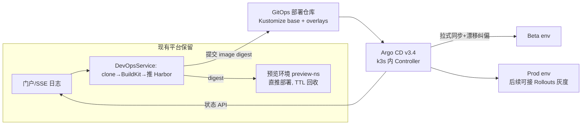

# Tekton + Argo CD 采纳方案建议

> 日期：2026-10-09　|　前提研究：[tekton-argocd-借鉴分析.md](./tekton-argocd-借鉴分析.md)
> 结论速览：**不整体引入 Tekton；分三阶段走——先加固自研 CI（阶段 0），生产 CD 切 Argo CD（阶段 1），Tekton 留作触发式评估（阶段 2）。** 与《全流程自动化发布与AI监控技术方案-2026》§3.1 的既定方向一致，本文给出可执行落地路径。

## 1. 总体思路

当前平台（k3sdemo）定位不变：**CI 执行器 + 预览环境管理器 + 统一门户**。改变的是生产部署路径：从「平台直推 patch Deployment」改为「平台/GitLab 提交 GitOps 仓库 → Argo CD 同步」。这样平台不再持有生产命名空间的写权限面（收窄为 Git 提交权），审计与回滚天然落到 Git 历史 + Argo CD。

## 2. 阶段 0：自研 CI 加固（不引新组件，约 3~5 天）

借鉴 Tekton 的模型语义，纯代码改造，为后续迁移留兼容：

| # | 改动 | 现状锚点 | 借鉴来源 |
|---|---|---|---|
| 0-1 | 镜像 tag 默认值 `latest` → `git-<sha8>`，PipelineRun 记录并持久化 image **digest**；预览与 Beta 晋升同一 digest，不重复构建 | `ReleaseConfig.java:6` 默认 `latest`；技术方案 §4.1 已要求禁止 latest | Tekton results / OCI 规范 |
| 0-2 | `PipelineConfig` 增加 per-step `timeout`/`retries` 字段（字段名对齐 Tekton TaskRun spec，语义兼容将来迁移） | 目前两模型均无 retry/timeout（grep 零命中） | Tekton TaskRun |
| 0-3 | 部署后验证门禁：readiness + 可配置冒烟 URL 校验后再标记 SUCCESS | `deployToK3s` 现为 `sleep(3000)` 轮询（DevOpsService.java:775 起） | Argo CD health assessment |

注意：0-3 与另一会话正在进行的 `DeploymentReadyVerifyTest` 改动可能重叠，动工前先对齐，避免撞文件。

## 3. 阶段 1：生产 CD 切 Argo CD（核心建议，约 1~2 周）

### 3.1 落地步骤

1. **建 GitOps 部署仓库**（放现有 GitLab）：`apps/<app>/base` + `overlays/{beta,prod}`，Kustomize 固定 image digest。
2. **k3s 内安装 Argo CD v3.4.x**（manifest 或 Helm，单集群 in-cluster 模式；约占 200~400MB 内存）。Argo CD 只读 Git + 调 K8s API，**不拉镜像**——Harbor 走 HTTP NodePort 30002 由节点 `k3s-registries.yaml` mirror 解决，对 Argo 无影响。
3. **ApplicationSet** 按「环境 × 应用」生成 Application，新增应用只改 generator 列表。
4. **平台改造**：`deployToK3s` 拆两路——预览命名空间维持直推（现状不变）；beta/prod 路径改为调 GitLab API 提交 overlay 的 digest 变更（平台已有 globalGitlabToken 基础），随后 Argo auto-sync 拉取。
5. **回滚与审计**：回滚 = git revert（或 Argo UI 任选历史版本）；审计 = Git blame + Argo 事件流。SSE 页面可后续接 Argo Application API 展示同步状态。

### 3.2 为什么现在不做 Rollouts 灰度

现有 Ingress（k3s 默认 Traefik）按权重分流的可靠性未验证，技术方案 §3.1 已明确「先验证入口能力再决定」。阶段 1 交付同步链路后，灰度作为阶段 1.5 独立试点，不阻塞主线。

## 4. 阶段 2：Tekton 迁移（触发式，暂不排期）

满足**任一**触发条件再评估，否则自研 CI 维持：

- 流水线步骤数 > 8 且频繁变更（改流水线要发版平台的痛感明显）；
- 需要断点续跑 / 步骤级缓存 / 跨团队共享 Task；
- 出现第二种以上语言栈的构建需求。

迁移路径（届时参考）：BuildKit Job → TaskRun（daemonless buildkit 镜像现成）；workspace-PVC 对应 Tekton Workspaces（PVC 型）；SSE 日志改经 Pod log API 透传；`restoreFromDatabase/markZombiesFailed` 整层可删（CRD 控制器自带恢复）。

## 5. 工作量与风险

| 项 | 估算 | 说明 |
|---|---|---|
| 阶段 0 | 3~5 人日 | 纯 Java 改造 + 测试 |
| 阶段 1 | 1~2 周 | 含 GitOps 仓库初始化、Argo 安装、平台双路改造、联调 |
| 阶段 2 | 届时评估 | 预计 2~3 周，含流水线语义迁移回归 |

主要风险：

1. **平台需新增 Git 写凭据**（替代部分集群写权限）——权限面收窄但非零，需限制到 GitOps 仓库单一 project 的 developer 角色。
2. **双路径过渡期复杂度**：预览直推 + 生产 GitOps 并存，UI 上要明确标注哪条路径，避免误判部署来源。
3. **Argo CD 引入后的运维面**：升级、RBAC、SSO 可后置，但 bootstrap 需要 1~2 天熟悉成本。
4. Harbor 若将来要接 cosign 签名/Argo CD Image Updater，需先升 HTTPS——本方案不依赖，但记录为前置债务。

## 6. 需要决策的点

1. 是否批准阶段 0 + 阶段 1 立即启动（或仅阶段 0）？
2. GitOps 仓库放现有 GitLab 的哪个 group/project？谁持有平台提交凭据？
3. beta/prod 目前是否真有多环境（还是单集群单 namespace）？若暂只有一套环境，阶段 1 可先只切 beta 验证链路，prod 随后。
