# K3s 全流程自动化发布与 AI 监控技术方案（2026）

> 版本：V1.0　|　方案日期：2026-10-04
> 适用项目：当前 Spring Boot K3s 管理平台（不是上游 K3s 发行版本身）
> 目标：基于现有 Git → K8s Job/Kaniko → Harbor → K3s 发布和多分支预览能力，补齐可审计 CI/CD、灰度、可观测与 AI 辅助诊断闭环。

## 1. 建议结论

采用“**Git 平台 CI 做质量与构建，Harbor 做制品可信存储，Argo CD 做生产 GitOps，K3s 承载预览/测试及按规模承载生产，Prometheus + OpenTelemetry + Loki + Grafana 做观测，规则引擎做发布判定，LLM 做只读分析**”的组合。

当前平台继续作为 K3s 管理与发布门户：复用已有流水线日志、Harbor 集成、K3s 部署、多分支预览、SSE 页面和 Qwen 接入；逐步将发布记录、环境状态、门禁结论和分析报告做成持久化的统一视图。生产环境部署最终由 GitOps 仓库声明，平台不直接持有长期集群管理员凭据，也不把 LLM 接入生产写操作。

```mermaid
flowchart LR
  Dev[需求分支 / PR] --> CI[GitLab CI 或 GitHub Actions]
  CI --> Gate[测试 / SAST / 依赖与镜像扫描]
  Gate --> Build[BuildKit 构建 OCI 镜像]
  Build --> Harbor[Harbor: digest / SBOM / 签名]
  Harbor --> Preview[当前平台: K3s PR 预览环境]
  Preview --> Verify[冒烟 / 契约 / e2e / 轻量性能]
  Verify --> GitOps[更新 GitOps 部署仓库]
  GitOps --> Argo[Argo CD 同步]
  Argo --> Canary[灰度 / 分批发布]
  Canary --> Obs[OTel + Prometheus + Loki + Grafana]
  Obs --> Rules[确定性 SLO 与回滚规则]
  Obs --> AI[AI 只读归因与处置建议]
  Rules -->|通过 / 自动回切| Canary
  AI --> Report[发布报告与人工确认事项]
  Rules --> Promote[验收后晋升同一 digest]
```



## 2. 当前项目基线与主要差距

项目 README 显示现有能力包括：Spring Boot 管理控制台、Fabric8 Kubernetes Client、集群内 Kaniko 构建、Harbor 推送、直接更新 Deployment、多分支合并预览命名空间、SSE 流式日志、Qwen AI 问答。代码中也存在独立的 `DevOpsService`、`ReleaseService`、发布/流水线状态接口以及 Python runtime 设计稿。

方案升级重点：

| 能力 | 当前基础 | 建议补齐 |
|---|---|---|
| 触发与代码门禁 | 平台内发起构建/发布 | PR 状态检查、分支保护、外部 CI；平台提供 webhook/API 与状态汇总 |
| 构建可信度 | Kaniko Job 构建并推 Harbor | 统一 OCI digest；SBOM、漏洞策略、来源证明和签名；验证后按 digest 晋升 |
| 部署控制 | 服务直接创建或更新 Deployment | 测试预览可沿用；生产通过 GitOps 仓库变更和 Argo CD 同步 |
| 灰度与回退 | 现有滚动更新、预览部署 | 引入 Argo Rollouts 或按入口能力选 Flagger；绑定指标分析与确定性自动回退 |
| 观测 | Pod/事件/日志查看与 AI 问答 | 统一指标、日志、Trace、发布事件和版本标签；定义服务 SLO |
| 发布记录 | 运行状态以内存对象为主 | 数据库持久化发布状态、审批、digest、环境、指标窗口和 AI 报告 |
| AI 运维 | Qwen 问答/建议 | 由告警和异常检测触发、脱敏/限量上下文、结构化归因；AI 不拥有执行权限 |

## 3. 目标架构

### 3.1 职责边界

1. **代码与 CI**：GitLab CI 或 GitHub Actions（二选一，跟随现有 Git 托管）。负责 PR 门禁、测试、静态检查、构建、镜像扫描和制品元数据。
2. **镜像与供应链**：Harbor 保留为镜像仓库；使用不可变 digest 作为跨环境的唯一制品身份。生成 SBOM，实施漏洞策略，并在可行时对镜像签名、验证签名及来源证明。
3. **当前 K3s 管理平台**：负责预览环境创建/回收、集群只读运维视图、发布记录、分析报告和手动授权入口。把耗时流水线执行统一交给可恢复的 K8s Job 或 CI worker，不依赖 Web 请求线程生命周期。
4. **GitOps CD**：Helm/Kustomize 部署清单放入独立部署仓库；Argo CD 负责将期望状态同步到 K3s。CI 更新环境 overlay 的 digest，不直接对生产执行 `kubectl apply`。
5. **发布策略**：首选 Argo Rollouts 管理 Canary/Blue-Green 和 AnalysisTemplate；是否需要 Istio/Ingress Controller 扩展取决于入口控制器能力。先验证现有 Ingress 能否可靠按权重分流，不能时再引入 Gateway API 实现或 Service Mesh，避免为了灰度先承担全量 Mesh 运维复杂度。
6. **观测**：应用通过 OpenTelemetry SDK/自动探针输出 trace 与标准化指标；节点/容器由 OpenTelemetry Collector 或 Grafana Alloy 收集；Prometheus 兼容指标存储，Loki 存日志，Tempo 存 Trace，Grafana 展示和关联。小规模可先单集群部署、限制保留期；高可用与长期留存再采用远端对象存储/托管后端。
7. **告警与 AI**：Prometheus/Alertmanager 及告警规则判定确定性事实；AI 服务按异常事件取得最小化数据，给出根因候选、证据、置信度和建议，供发布报告/通知使用。AI 不获得 Kube API 写权限。

### 3.2 环境规划

| 环境 | 部署方式 | 用途与边界 |
|---|---|---|
| PR Preview | 当前平台按 PR 创建短期 namespace、独立域名/NodePort、TTL 回收 | 多分支集成、冒烟/e2e；网络隔离、资源配额和默认拒绝 NetworkPolicy；仅使用 mock 或脱敏数据 |
| Beta/Staging | GitOps 自动同步固定环境 overlay | 验证部署、迁移、回归、业务验收；版本和生产尽量同 chart/配置结构，不复制生产敏感数据 |
| Production | GitOps 同步；按风险配置渐进流量 | Canary 分析通过后扩大流量；数据库迁移采用向前兼容/Expand-Contract |

Beta 可以与生产使用相同版本化配置模板，但不建议仅以“同集群”假设等价。生产安全域、数据规模、节点容量、依赖服务、流量路径若不同，必须记录差异，生产灰度指标仍是最终依据。

## 4. 发布流程

### 4.1 PR 与构建阶段

1. 开发者推送短期 feature 分支并创建 PR；主干禁止直接推送，要求 Code Review 和必需状态检查。
2. CI 执行格式/lint、单元测试、集成/契约测试、Secret 检测、SAST、依赖许可证/漏洞扫描。质量门槛按仓库实际基线设定，不建议先用统一覆盖率数字堵塞旧项目；新增代码与关键模块逐步提高门槛。
3. 对可信分支构建一次 OCI 镜像，记录 `git SHA`、镜像 digest、构建流水线链接、SBOM、扫描结果、基础镜像版本和构建来源。禁止将 `latest` 作为环境部署依据。
4. PR 镜像部署到隔离的 K3s Preview namespace；执行 readiness、冒烟、契约/e2e 测试。并发数、CPU/内存 quota、TTL 及失败回收策略作为必需配置。
5. 合并主干后仍引用同一提交和 digest，部署到 Beta；不因为环境不同重新构建。

### 4.2 灰度与发布验收

生产部署通过 GitOps 修改目标 digest。依据服务风险设置 Canary 阶段，例如 5% → 20% → 50% → 100%；各步持续时间由请求量和业务周期决定，不统一强设 30 分钟或 24 小时。若低流量服务在窗口内样本不足，判定为“证据不足/暂停”，不可自动判通过。

每一步只由可观测数值和预设策略决定继续、暂停或回退：

- 错误率、P95/P99 延迟、流量、饱和度、健康探针、Pod 重启/OOM。
- 关键业务指标（例如成功下单率、支付失败率），按服务实际定义。
- 绝对阈值与新旧版本对照同时使用；过滤发布前已有故障，并按请求量设最低样本数。
- 触发回退时由 Rollouts/控制器执行切回已知良好 ReplicaSet/digest；旧 ReplicaSet 保留到观察完成。
- Canary 结束且 SLO 达标后，将同一 digest 晋升为稳定版本并关闭灰度；验收失败则保留失败证据、回滚并生成事件。

不把“运行满 24 小时”作为一刀切成功条件。按服务 SLO 观察窗口、流量量级、业务高峰及错误预算定义发布验收窗口；关键业务可跨越完整业务周期。

## 5. SLO、门禁与回滚

每个服务必须有 `service.name`、环境、版本/digest 等统一标签，并维护服务级 SLO。可用性、延迟和业务成功率阈值由实际 SLI 基线与业务要求确定。示例策略仅作为起点：

| 信号 | 示例判定 | 动作 |
|---|---|---|
| 发布后 5xx 相对基线明显升高且超过服务硬阈值 | 连续多个评估点超限且最小请求数满足 | 自动暂停扩流；达到严重条件则自动回切 |
| P95/P99 延迟超过目标或较稳定版本显著劣化 | 与同入口、同时间窗口的 stable 对照 | 暂停；结合 SLO burn rate 决定回退 |
| Ready 副本不足、CrashLoop/OOM、启动探针连续失败 | Kubernetes 状态信号 | 暂停或自动回切 |
| 业务关键成功率下降 | 服务专属指标，不以通用 HTTP 状态代替 | 高风险服务直接回切或转人工 |
| AI 给出高风险根因 | 需附带证据和置信度 | 告警、暂停人工观察；不单独回滚 |

回退权由确定性策略控制器持有，动作写入审计记录。采用“硬阈值/分析策略触发暂停或回退；AI 提供解释”的分工，避免 LLM 幻觉导致误操作。人工绕过应限定角色、环境、原因、有效期，并写入审计事件。

## 6. AI 监控设计

### 6.1 输入与分析过程

数据源优先级：告警事件 + Prometheus 指标 + Loki 聚合日志 + Trace 摘要 + Kubernetes Event + 最近部署与配置变更。AI 输入经过敏感字段脱敏、按时间窗聚合、错误指纹去重、采样和 token 限额；不上传完整日志流、环境变量、Secret 或未经筛选的用户数据。

LLM 给出可解析结构：

```json
{
  "summary": "连接池等待超时在新版本灰度后增加",
  "severity": "P1",
  "confidence": 0.82,
  "evidence": ["异常指纹 ...", "版本 v... 的 P99 ...", "变更 ..."],
  "suspected_change": ["commit SHA / 文件 / 行号"],
  "recommendation": "暂停扩流，检查连接池配置与下游延迟",
  "needs_human": true
}
```

AI 输出必须包含证据引用，不能把推断包装成确定事实；证据不足时返回 `unknown`。发布报告展示“监控规则结论”和“AI 推断”两栏，便于审阅。

### 6.2 分阶段自动化权限

| 阶段 | AI 能力 | 自动动作 |
|---|---|---|
| 观察期 | 聚类、摘要、根因候选、变更关联 | 只记录和通知 |
| 试运行 | 报告建议及置信度；与人工根因对照 | 仅规则引擎可暂停；生产自动回退仍由固定 SLO 规则触发 |
| 成熟后 | 对已验证模式生成更细建议 | 可经审批将经验证的新规则纳入策略；AI 始终不能直接调用生产写 API |

衡量 AI 价值使用误报率、漏报率、根因 Top-k 命中率、报告可采纳率、平均定位时间与单次成本；不要以“AI 判断准确率 ≥80%”单一指标作为上线许可。

## 7. 安全、可靠性与离线约束

- **权限**：CI、Argo CD、预览控制器使用分环境 ServiceAccount；按 namespace/资源最小授权。平台不读取 Secret 明文用于分析；Git token、Harbor 凭据从受控 Secret 管理系统注入，避免保存在普通发布记录或日志。
- **构建隔离**：K8s 构建 Job 使用独立 ServiceAccount、禁用特权容器、限制网络与资源、使用非 root 构建器；限制不可信 PR 构建访问集群、Harbor 凭据和内网服务。
- **供应链**：优先使用受支持的 OCI 构建器（如 BuildKit/buildx）和可信基础镜像；Kaniko 可作为当前过渡实现，但须核查其维护与安全状态，不能仅因现有集成就把它视为长期默认。签名/来源证明应验证，而非只生成。
- **镜像版本**：以 digest 锁定基础镜像及部署镜像；SBOM、签名、扫描结果与 Git SHA 一并归档。上线先验证依赖、许可证和离线镜像缓存。
- **离线部署**：明确区分“镜像离线”和“依赖离线”。若完全断网，需内部 Maven/PyPI/npm/OS 包镜像、基础镜像仓库、插件/工具缓存以及模型服务本地可达；只预热基础镜像不足以支持完整构建。
- **K3s 容量**：Preview 与生产共享集群时设置 ResourceQuota/LimitRange、NetworkPolicy、节点污点/容忍和并发限额。生产可用性、备份和控制面拓扑需结合实际节点数评估；单节点集群不提供节点级高可用保证。
- **状态可靠性**：发布 run、灰度步骤、审批、操作人、镜像 digest、策略快照和报告写入数据库；对 K8s Job/Argo 状态做幂等同步，控制器重启后可恢复，不依赖 JVM 内存 Map。
- **审计**：所有生产变更留存 Git commit、Argo sync、Rollout history、策略评估、回滚原因和人工豁免记录。

## 8. 组件建议与版本治理

| 职责 | 主选 | 备选/说明 |
|---|---|---|
| CI | 当前 Git 托管平台的原生 CI（GitLab CI 或 GitHub Actions） | Jenkins 仅在已有成熟运维投入时保留 |
| 镜像仓库 | Harbor | 继续复用项目现有配置；启用不可变标签/访问控制/漏洞扫描 |
| OCI 构建 | BuildKit/buildx | 当前 Kaniko 流程可短期保留，先核实官方维护与集群兼容性，再按构建任务迁移 |
| GitOps | Argo CD | Flux 适合偏轻量 GitOps；结合团队已有能力择一，避免双控制器管理同一资源 |
| 灰度 | Argo Rollouts | 入口需支持可控权重；Flagger 可作为已有 Prometheus/入口集成的备选 |
| 指标/日志/Trace | Prometheus 兼容指标 + Loki + Tempo + Grafana + OpenTelemetry | 小规模可先不部署完整 Trace 存储，但应用接入 OTel 规范，保留扩展路径 |
| AI | 现有 Qwen API 接入 + 独立分析 Worker | 私有模型或企业 API 按数据边界、延迟、成本选择 |
| 数据存储 | 现有基础设施支持的 PostgreSQL 优先 | 当前只有少量运行数据时可短期使用关系型存储；避免继续依赖进程内状态 |

本方案以架构和兼容性作为 2026 基线，**不在未完成官方发布页核对的情况下填写具体“最新版”号**。实施时在 ADR/BOM 锁定 Kubernetes/K3s 支持矩阵、Argo CD/Rollouts、Prometheus Operator、Loki/Tempo、Collector、BuildKit、Trivy、Harbor 的受支持稳定版本；先核对 upstream release、兼容矩阵和 CVE，再固定镜像 digest。生产禁止 `latest` 标签自动升级，按月评估补丁、按季度评估次版本。

## 9. 对当前项目的改造切片

### P0：发布基础可靠化（约 1–2 周，视资源调整）

- 发布记录及流水线状态持久化；外部构建/部署状态可恢复。
- 统一 `commit SHA + image digest + runtime + namespace + environment` 元数据。
- 取消默认 `latest` 作为部署输入；添加幂等、超时、取消、孤儿 Job 清理。
- Preview namespace 配额、TTL、网络隔离和身份校验。
- 保护现有平台管理员和 Harbor/SCM 凭据，检查日志脱敏。

**退出条件**：平台/Pod 重启后能恢复运行中和已完成发布状态；digest 可从页面追溯到 Git 提交和扫描结果。

### P1：标准化 CI 与 Beta（约 2–3 周）

- 接入 Git 平台 webhook/API；PR 门禁与状态回写。
- 测试、SAST、依赖/镜像扫描、SBOM；主干构建一次并推送 Harbor。
- 自动部署 Preview/Beta，冒烟/e2e 结果进入发布记录。
- 将用户提供的 Python runtime 设计稿纳入验收字段：统一仓库 Dockerfile 优先级、参数校验、离线包源说明、两条流水线同规则。

**退出条件**：合并主干后以同一 digest 部署 Beta；PR Preview 可回收，安全门禁失败会阻断。

### P2：GitOps 与灰度回滚（约 2–4 周）

- 建立独立 Helm/Kustomize GitOps 仓库、Argo CD AppProject/RBAC。
- 选择并验证支持权重流量的入口；安装 Argo Rollouts，先对低风险服务做灰度。
- 绑定 Prometheus AnalysisTemplate 与稳定版本对照；演练暂停、回切和人工豁免。

**退出条件**：演练失败指标触发自动暂停/回切；生产部署与回退均有 Git 和控制器审计记录。

### P3：可观测性与 AI 辅助验收（约 3–5 周，可与 P2 部分并行）

- 建立 OTel 资源标签、日志字段、服务 SLI/SLO、Grafana 发布视图。
- 先跑 2–4 周只告警/只分析的影子模式，校准阈值、脱敏、成本和质量。
- AI Worker 输出证据化 JSON 报告；将 AI 告警关联到发布 run 和 Git 变更。
- 报告包含指标窗口、变更清单、Rollout 结果、已知风险、AI 摘要和人工处置项。

**退出条件**：连续若干次发布完成“指标门禁 + 证据报告 + 审计回放”；达到团队定义的误报/漏报、定位时间和成本目标后，再评估扩大 AI 自动化范围。

## 10. 发布报告与数据模型建议

建议用关系表保存 `release_run`、`artifact`、`environment_deployment`、`rollout_step`、`gate_evaluation`、`incident_analysis`、`approval_audit`。核心字段包括：

- 关联 ID：Git provider/repository/PR/commit SHA、CI run、K8s namespace、Deployment/Rollout。
- 制品：仓库地址、OCI digest、SBOM 地址、签名/来源证明、漏洞扫描策略版本。
- 过程：当前阶段、步骤时间、Job/Rollout UID、结果、日志对象存储地址。
- 验收：指标名称、查询窗口、样本数、阈值、实测值、判定、规则版本。
- AI：模型/提示模板版本、脱敏标记、证据引用、置信度、建议和人工反馈。
- 操作：操作者、角色、动作、理由、审批链、时间、前后状态。

敏感日志不直接塞进数据库或 LLM 请求；保存有权限控制和 TTL 的日志引用及聚合摘要。

## 11. 关键待确认项与落地前检查

当前材料没有给出 Git 托管平台、生产入口控制器、节点数量与规格、生产是否离线、应用清单与流量/SLO、是否已有 Prometheus/日志平台等信息。因此方案采用可替换组件和渐进式默认值。进入 P1/P2 前核对：

1. GitLab/GitHub/其他平台及 webhook 能力。
2. K3s 版本、server/agent 节点数、架构与可用资源；Preview 是否与生产隔离。
3. Ingress/Gateway 现状和流量权重能力。
4. 是否完全离线，以及内部制品/依赖仓库、证书、DNS、对象存储情况。
5. 每个生产服务的 SLO、关键业务指标、允许自动回退的发布范围。
6. 现有 Qwen 接口的数据处理要求、日志保留期和预算。

这些信息会决定具体组件版本、拓扑、高可用和门禁数值；不会改变“同一 digest 晋升、GitOps 部署、确定性规则控动作、AI 只读辅助、审计可追溯”的总体原则。
